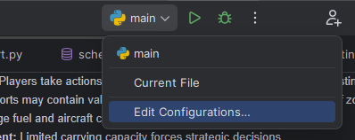
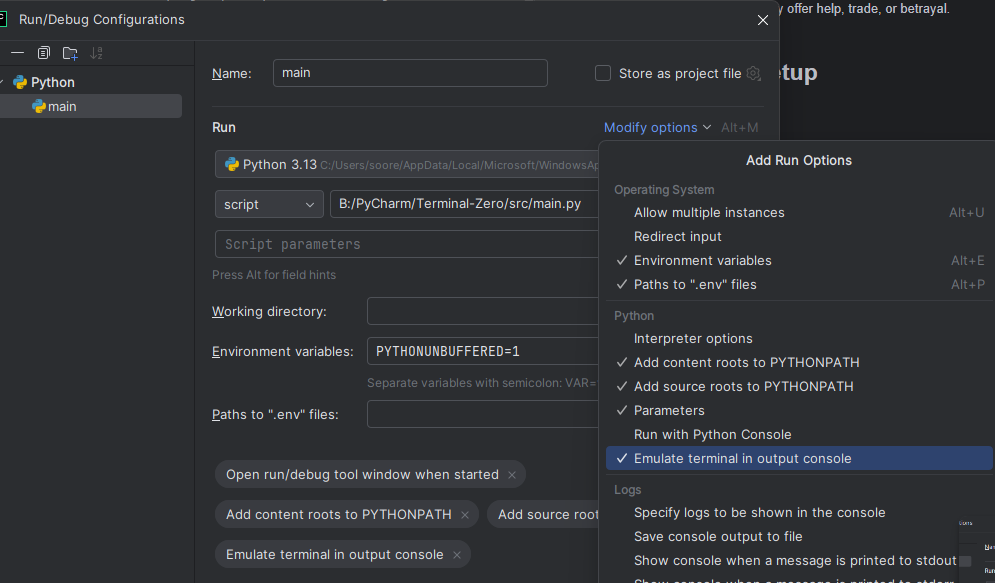

# Terminal Zero - A Survival Game

## 📌 Overview
Terminal Zero is a **text-based survival game** where players navigate through airports in a world overrun by a zombie virus. The goal is to **find resources, manage supplies, avoid zombies, and reach the final safe zone** before it's too late!

## 🎮 Gameplay Features
- **Turn-based system:** Players take actions each turn, including searching for supplies, or traveling.
- **Random events:** Airports may contain valuable resources, hostile survivors, or hordes of zombies.
- **Flight system:** Manage fuel and aircraft condition to travel between locations.
- **Inventory management:** Limited carrying capacity forces strategic decisions.
- **Survivor encounters:** NPCs may offer help, trade.

## 🔧 Installation & Setup
### Prerequisites
- Python 3.x
- SQLite3 (for database management)
### [!] NOTE
if you are using Pycharm, make sure to enable terminal emulator to activate the colored output:
- 1. 
- 2. 

### Installation Steps
1. **Clone the repository:**
   ```bash
   git clone https://github.com/yourusername/TerminalZero.git
   cd TerminalZero
   ```
2. **Create a virtual environment (optional but recommended):**
   ```bash
   python -m venv venv
   source venv/bin/activate  # On Windows use 'venv\Scripts\activate'
   ```
3. **Install dependencies:**
   ```bash
   pip install -r requirements.txt
   ```
4. **Initialize the database:**
   ```bash
   python database/db_manager.py
   ```
5. **Run the game:**
   ```bash
   python game/app.py
   ```

## 📂 Project Structure
```
TerminalZero/
│── database/                # Database schema & manager
│── src/                     # Game logic
│   ├── main.py              # Entry point
│   ├── game.py              # Core game loop
│   ├── player.py            # Player attributes & actions
│   ├── airport.py           # Airport interactions
│   ├── events.py            # Random encounters
│   ├── Helpers.py           # General usage functions and variables 
│   ├── inventory.py         # Inventory system
│   ├── ui.py                # User interface (text-based)
│── config/                  # Game settings
│── README.md                # Documentation
│── requirements.txt         # Dependencies
```


