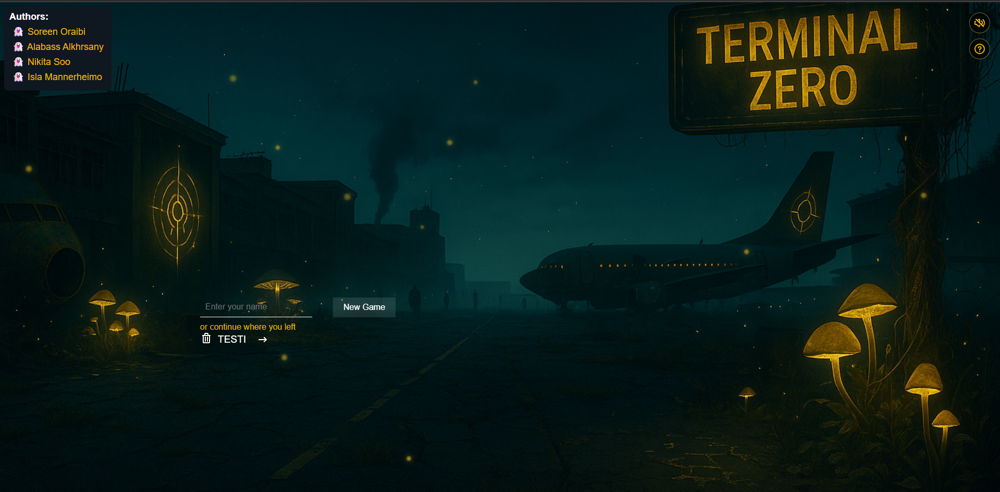
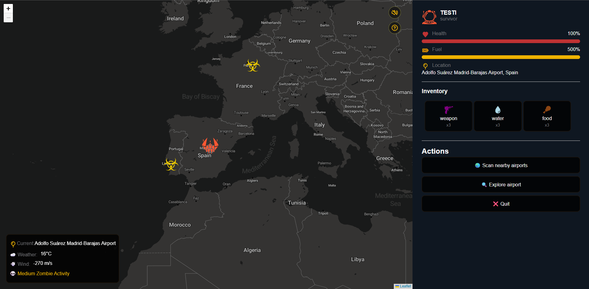

# Terminal Zero - A Survival Game

## 📌 Overview
Terminal Zero is a **point-and-click, browser-based survival game** set in airports plagued by a zombie outbreak. The goal is to **find resources, manage supplies, avoid zombies, and reach the final safe zone** before it's too late!

## 🎮 Gameplay Features
- **Turn-based system:** Players take actions each turn, including searching for supplies, or traveling.
- **Random events:** Airports may contain valuable resources, hostile survivors, or hordes of zombies.
- **Flight system:** Manage fuel to travel between locations.
- **Inventory management:** Limited carrying capacity forces strategic decisions.
- **Survivor encounters:** NPCs may offer help, trade.

## ✨ Preview
- 
- 
- 
- 

## 🔧 Installation & Setup
### Prerequisites
- Python 3.x
- MariaDB (for database management)
- Flask
- Python-dotenv
- Colorama
- Rich

### Installation Steps
1. **Clone the repository:**
   ```bash
   git clone https://github.com/yourusername/TerminalZero.git
   cd TerminalZero
   ```
2. **Create a virtual environment (optional but recommended):**
   ```bash
   python -m venv venv
   source venv/bin/activate  # On Windows use 'venv\Scripts\activate'
   ```
3. **Install dependencies:**
   ```bash
   pip install -r requirements.txt
   ```
4. **Add a .env file:**
   ```bash
   Include the next into .env file:
      MARIADB_USER = 'username'
      MARIADB_PASSWORD = 'password'
      MARIADB_HOST = 127.0.0.1
      MARIADB_PORT = 3306
      MARIADB_DATABASE = database_name
      FLASK_RUN_HOST="127.0.0.1"
      FLASK_RUN_PORT="5000"
   ```
5. **Initialize the database:**
   ```bash
   python database/db_manager.py
   ```
6. **Run the game:**
   ```bash
   python python backend/templates/app.py
   ```
7. **Open the game:**
   ```bash
   start frontend/pages/startscreen/index.html
   ```

## 📂 Project Structure
```
Terminal-Zero/
│── backend/
|   |── Api                  # Flask API
|   |── Config               # Schema & settings
|   |── Database             # Database manager
|   |── app.py               # Server launcher
│── frontend/                # Game logic
|   |── assets/              # Audio & images
|   |── js/                  # Javascript files
|      |── Components        # User Interface components
|      |── Game
|         ├── game.js              # Core game loop
|         ├── player.js            # Player attributes & actions
|         ├── airport.js           # Airport interactions
|         ├── events.js            # Random encounters
|         ├── Helpers.js           # General usage functions and variables 
|         ├── inventory.js         # Inventory system
|      |── Utils             # Backend queries
|   |── Pages                # Web-pages and styling
|── .env                     # database settings
│── README.md                # Documentation
│── .gitignore               # Git ignore 
│── requirements.txt         # Dependencies
```